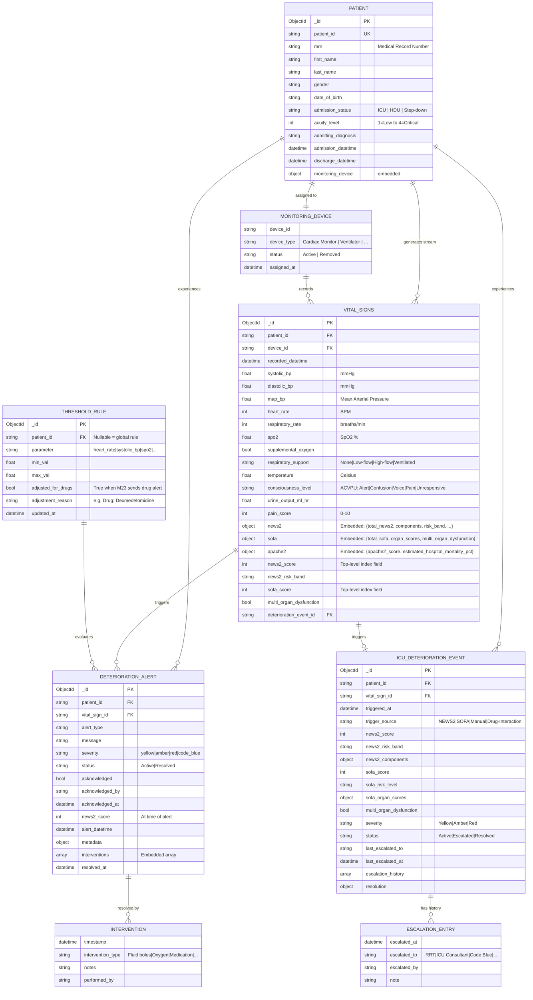

```mermaid
erDiagram

    PATIENT ||--o{ VITAL_SIGNS : "generates stream"
    PATIENT ||--o{ DETERIORATION_ALERT : "experiences"
    PATIENT ||--o{ ICU_DETERIORATION_EVENT : "experiences"
    PATIENT ||--|| MONITORING_DEVICE : "assigned to"

    MONITORING_DEVICE ||--o{ VITAL_SIGNS : "records"

    VITAL_SIGNS ||--o{ DETERIORATION_ALERT : "triggers"
    VITAL_SIGNS ||--o| ICU_DETERIORATION_EVENT : "triggers"

    THRESHOLD_RULE ||--o{ DETERIORATION_ALERT : "evaluates"

    DETERIORATION_ALERT ||--o{ INTERVENTION : "resolved by"

    ICU_DETERIORATION_EVENT ||--o{ ESCALATION_ENTRY : "has history"

    PATIENT {
        ObjectId _id PK
        string patient_id UK
        string mrn "Medical Record Number"
        string first_name
        string last_name
        string gender
        string date_of_birth
        string admission_status "ICU | HDU | Step-down"
        int acuity_level "1=Low to 4=Critical"
        string admitting_diagnosis
        datetime admission_datetime
        datetime discharge_datetime
        object monitoring_device "embedded"
    }

    MONITORING_DEVICE {
        string device_id
        string device_type "Cardiac Monitor | Ventilator | ..."
        string status "Active | Removed"
        datetime assigned_at
    }

    VITAL_SIGNS {
        ObjectId _id PK
        string patient_id FK
        string device_id FK
        datetime recorded_datetime
        float systolic_bp "mmHg"
        float diastolic_bp "mmHg"
        float map_bp "Mean Arterial Pressure"
        int heart_rate "BPM"
        int respiratory_rate "breaths/min"
        float spo2 "SpO2 %"
        bool supplemental_oxygen
        string respiratory_support "None|Low-flow|High-flow|Ventilated"
        float temperature "Celsius"
        string consciousness_level "ACVPU: Alert|Confusion|Voice|Pain|Unresponsive"
        float urine_output_ml_hr
        int pain_score "0-10"
        object news2 "Embedded: {total_news2, components, risk_band, ...}"
        object sofa "Embedded: {total_sofa, organ_scores, multi_organ_dysfunction}"
        object apache2 "Embedded: {apache2_score, estimated_hospital_mortality_pct}"
        int news2_score "Top-level index field"
        string news2_risk_band
        int sofa_score "Top-level index field"
        bool multi_organ_dysfunction
        string deterioration_event_id FK
    }

    THRESHOLD_RULE {
        ObjectId _id PK
        string patient_id FK "Nullable = global rule"
        string parameter "heart_rate|systolic_bp|spo2|..."
        float min_val
        float max_val
        bool adjusted_for_drugs "True when M23 sends drug alert"
        string adjustment_reason "e.g. Drug: Dexmedetomidine"
        datetime updated_at
    }

    DETERIORATION_ALERT {
        ObjectId _id PK
        string patient_id FK
        string vital_sign_id FK
        string alert_type
        string message
        string severity "yellow|amber|red|code_blue"
        string status "Active|Resolved"
        bool acknowledged
        string acknowledged_by
        datetime acknowledged_at
        int news2_score "At time of alert"
        datetime alert_datetime
        object metadata
        array interventions "Embedded array"
        datetime resolved_at
    }

    INTERVENTION {
        datetime timestamp
        string intervention_type "Fluid bolus|Oxygen|Medication|..."
        string notes
        string performed_by
    }

    ICU_DETERIORATION_EVENT {
        ObjectId _id PK
        string patient_id FK
        string vital_sign_id FK
        datetime triggered_at
        string trigger_source "NEWS2|SOFA|Manual|Drug-Interaction"
        int news2_score
        string news2_risk_band
        object news2_components
        int sofa_score
        string sofa_risk_level
        object sofa_organ_scores
        bool multi_organ_dysfunction
        string severity "Yellow|Amber|Red"
        string status "Active|Escalated|Resolved"
        string last_escalated_to
        datetime last_escalated_at
        array escalation_history
        object resolution
    }

    ESCALATION_ENTRY {
        datetime escalated_at
        string escalated_to "RRT|ICU Consultant|Code Blue|..."
        string escalated_by
        string note
    }
```
